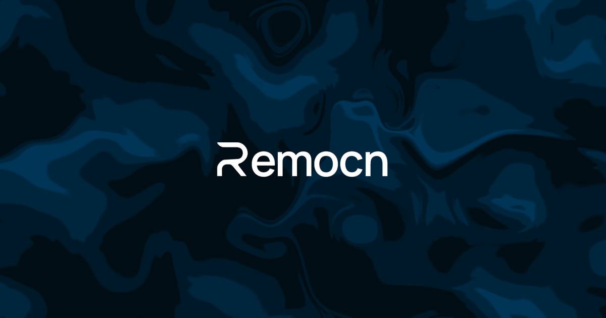

<p align="center">
  
</p>


# Remocn

remocn is a copy-paste component library for building videos in Remotion. Instead of writing every fade, wipe, and kinetic title from scratch, you `npx shadcn add` a polished primitive into your project and own the code. Built for solo builders and small teams who need a product demo video shipped today, not next week.

## Why remocn

- **Remotion has no batteries-included component library** You either build every animation from scratch or copy snippets from blog posts. remocn gives you a curated registry of primitives and full scenes that just work.
- **Polished motion is hard** Easing curves, spring physics, transition timing - remocn ships components that already feel right, so you can focus on storytelling instead of tuning `interpolate()` calls.
- **You own the code** Components are copied into your repo (shadcn philosophy). No runtime dependency, no version lock-in, no black box - tweak anything you want.
- **Solo builders need demo videos fast** Compose a launch trailer, changelog clip, or feature walkthrough from prebuilt blocks in an afternoon.

## What's inside

110+ components, split between scene-ready animations and timeline-driven UI primitives:

- **Typography** — Soft Blur In, Per Character Rise, Tracking In, Typewriter, Shimmer Sweep, Marker Highlight, Slot Machine Roll, Matrix Decode, RGB Glitch Text, Number Wheel, Rolling Number, Infinite & Perspective Marquee, and 30+ more text effects
- **Transitions & wipes** — Zoom Through, Device Mockup Zoom, Image Expand to Fullscreen, Directional Wipe, Spatial Push, Frosted Glass Wipe, Grid Pixelate Wipe, Chromatic Aberration Wipe
- **Environment & effects** — Mesh Gradient Background, Dynamic Grid, Spotlight Card, Confetti, Backdrop
- **UI blocks** — Glass Code Block, Terminal Simulator, Code Accordion, Code Diff Wipe, Tool Menu Slide In, Animated Line & Bar Charts, Drag and Drop Flow
- **AI scenes** — Claude Chat, ChatGPT, v0, Claude Code, OpenCode
- **Social** — GitHub Stars, X Follow Card, X Followers Overview
- **Compositions** — Hero Device Assemble, Ecosystem Constellation, Infinite Bento Pan, Browser Flow, AI Generation Canvas, Live Code Compilation, Terminal to Browser Deploy, Dashboard Populate, Pricing Tier Focus
- **UI primitives** (`remocn-ui`) — timeline-driven, shadcn-style atoms: Button, Accordion, Dialog, Drawer, Sheet, Select, Dropdown Menu, Command Menu, Tabs, Tooltip, Toast, Popover, Slider, Stepper, Resizable, and full flows (Signup, Checkout, Settings Toggle)

Browse the full catalog with interactive previews at [remocn.dev](https://remocn.dev).

## remocn/ui

`remocn/ui` is a separate registry of **timeline-driven UI primitives** — the components you'd reach for in shadcn (Button, Dialog, Dropdown Menu, Tabs, Command Menu, Toast…), but rebuilt for video. Every state change is keyframe-driven instead of event-driven: a primitive plays through its open/close, focus, hover, and selection states on the Remotion timeline, so you can animate a real UI walkthrough — a signup form filling in, a dropdown opening, a checkout completing — frame by frame.

All atoms share one core lib (`remocn-ui`) and follow the same steps API, so they compose into full flows: **Signup**, **Checkout**, and **Settings Toggle** ship ready to drop into a scene.

<!-- TODO: загрузить mp4 через GitHub UI (перетащить файл в редактор README) и вставить голую ссылку на github.com/user-attachments/assets/... сюда -->

```bash
npx shadcn@latest add @remocn/ui-dropdown-menu
```

The atom lands in `components/remocn/ui-dropdown-menu.tsx`, pulls in the `remocn-ui` core lib, and is yours to edit.

## Installation

Remotion is a prerequisite — set up a Remotion project first if you don't have one (`npx create-video@latest`). Then add any component from the registry:

```bash
npx shadcn@latest add @remocn/blur-reveal
```

The component lands in `components/remocn/blur-reveal.tsx` and is yours to edit.
